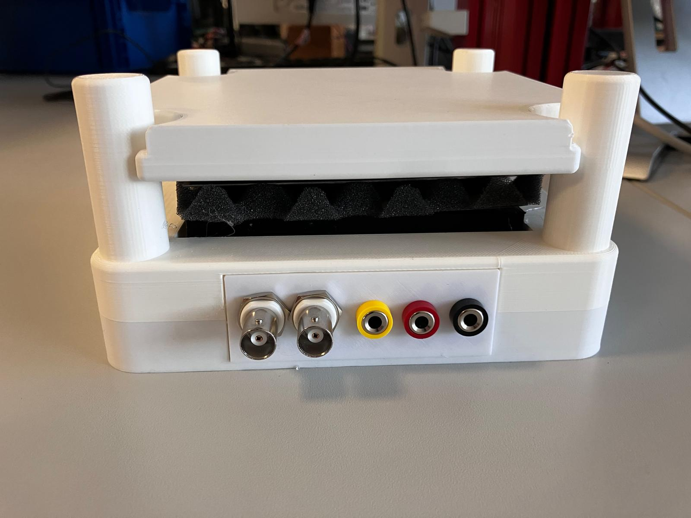

# Projekt 2: Kapazitiver Näherungssensor

## Einordnung
Projekt im Rahmen der Vorlesung **Interface Synthesis** (DHBW Mannheim).

## Bewertung
- 34 Prozentpunkte der Gesamtbewertung

## Abgabe
Die Abgabe umfasst:
- den Quellcode
- die Projektdokumentation  
  - Maximale Länge: sechs Seiten  
  - **IEEE Vorlage ist zu verwenden**
- alle in der Projektdokumentation zitierten eigenen Quellen
- den erstellten Aufbau
- die Projektvorstellung

## Aufgabenstellung (laut Folien)
- Kapazitiven Sensor entwerfen und aufbauen  
  - Anwendungsfall frei wählbar  
  - Thema ist mit dem Dozenten abzusprechen
- Analoge Signalauswertung mittels Brückenschaltung und Instrumentenverstärker entwerfen und aufbauen
- Digitale Signalauswertung mittels Red Pitaya entwickeln:
  - Digitale Werte erfassen
  - Berechnung der Kapazitätsänderung
  - Anzeige über Webserver (zusätzlich über LEDs)

## Technische Plattform
- Red Pitaya (Xilinx Zynq)
  - FPGA + Dual-Core ARM Prozessor
  - 2× ADC, 125 MS/s, 14 Bit
  - 2× DAC, 125 MS/s, 14 Bit
  - Ethernet

## Koheron SDK (Git Submodule)
- Das Repository `koheron-sdk` ist als Git-Submodule unter `./koheron-sdk` eingebunden.
- Initiales Klonen inklusive Submodule:
  `git clone --recurse-submodules <repo-url>`
- Falls das Repository bereits ohne Submodule geklont wurde:
  `git submodule update --init --recursive`
- Submodule auf den im Projekt hinterlegten Stand aktualisieren:
  `git submodule update --recursive`

## Sensorentwicklung und Auswertung
- Kapazitiver Messeffekt
- Wechselspannungsmessbrücke (Ausschlagmethode)
- Instrumentenverstärker
- Digitale Signalverarbeitung
- Effektivwert- und Phasenauswertung

## Dokumentation
- Struktur gemäß Vorgabe in den Folien
- IEEE Paper Template:
  https://www.ieee.org/conferences/publishing/templates.html

## Termin
- Vorstellung und Abgabe: **19.03.2026**
